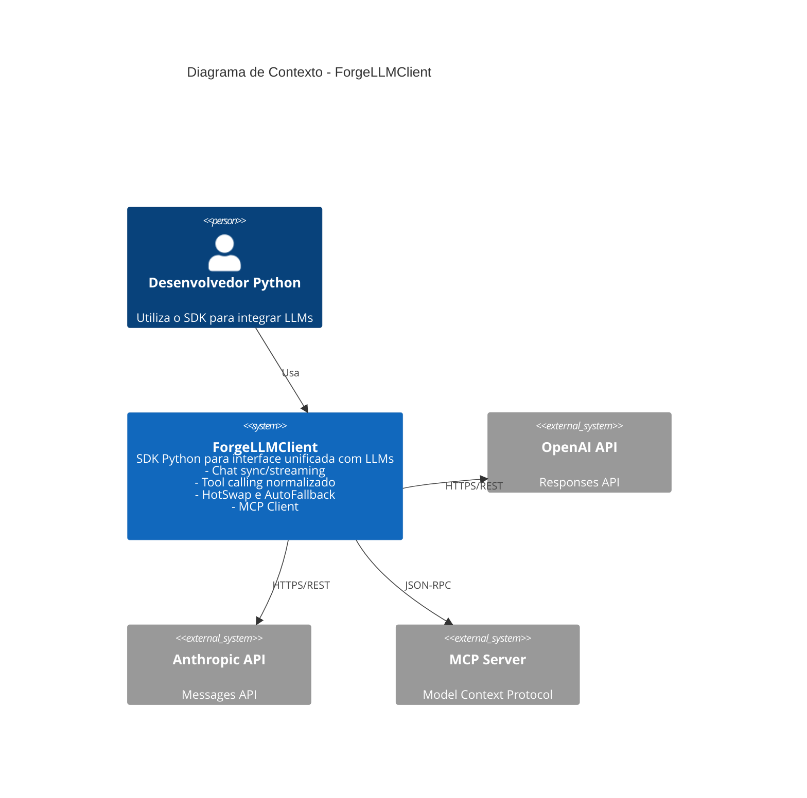
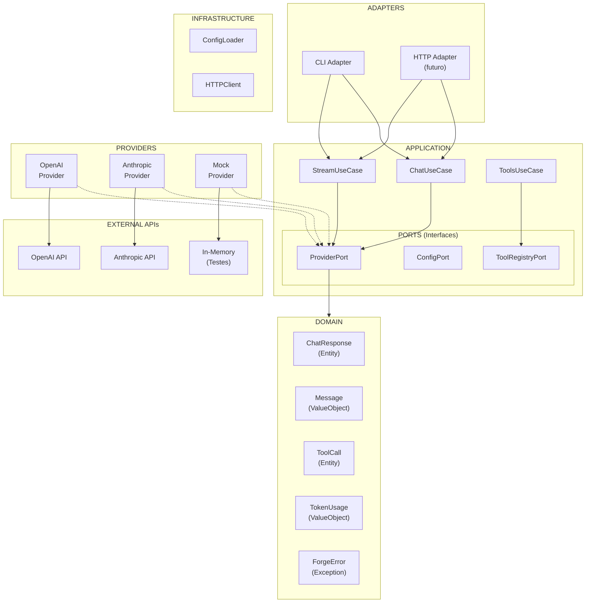
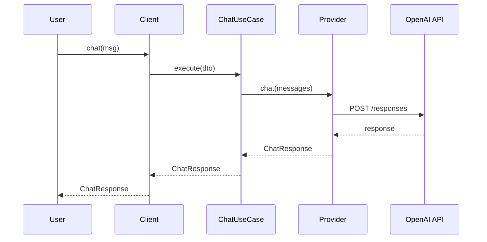
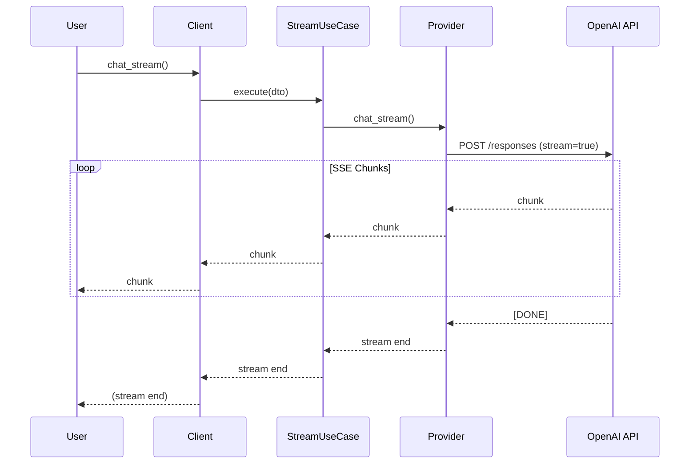
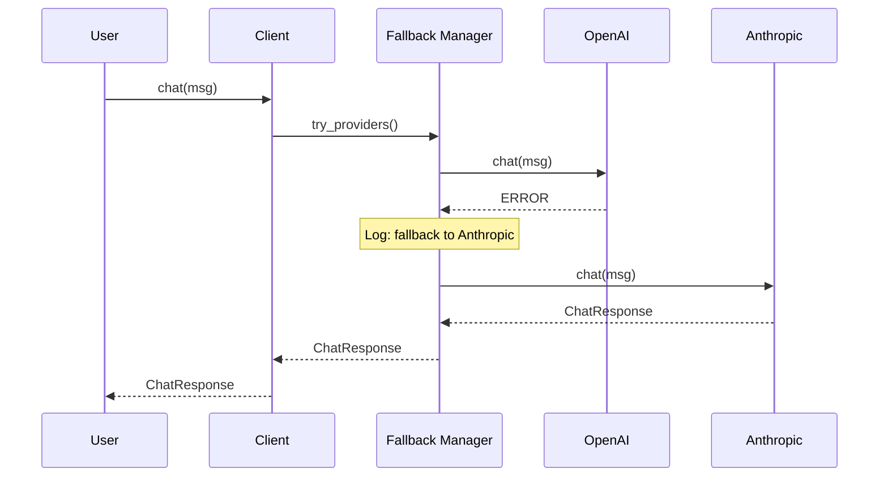
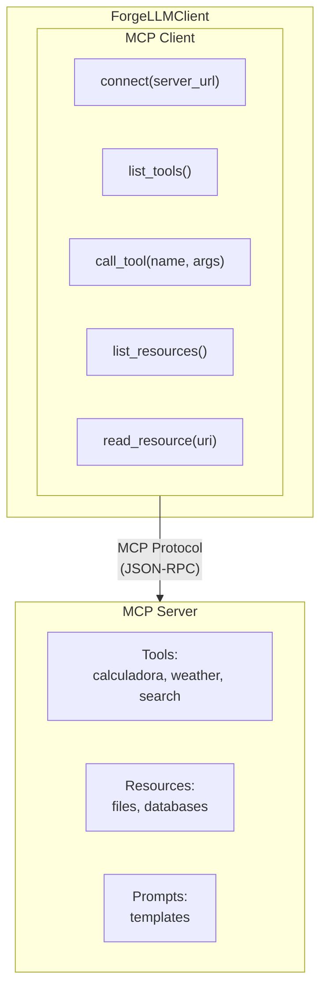
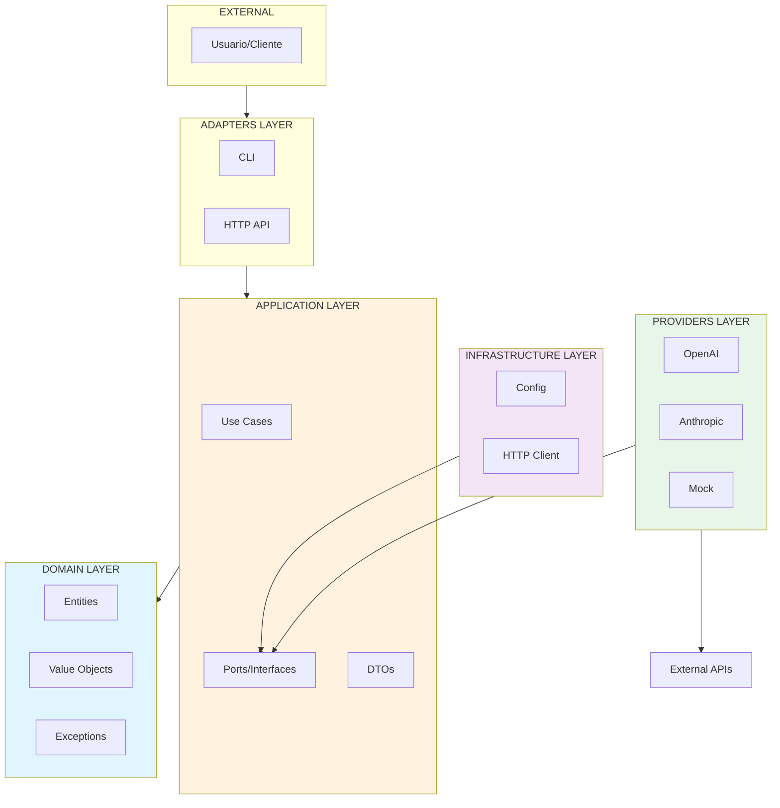

# HLD — ForgeLLMClient High Level Design

> **Versao:** 1.0
> **Data:** 2025-12-03
> **Status:** Aprovado

---

## 1. Visao Geral do Sistema

O ForgeLLMClient e um SDK Python que oferece interface unificada para multiplos provedores LLM, permitindo:

- **PortableChat**: Chat sync e streaming com interface padronizada
- **HotSwap**: Trocar provedor em runtime sem alterar codigo
- **AutoFallback**: Fallback automatico entre provedores
- **UnifiedTools**: Normalizacao de tool calling entre provedores
- **MCPClient**: Integracao com MCP (Model Context Protocol)

---

## 2. Diagrama de Contexto (C4)



---

## 3. Diagrama de Componentes



---

## 4. Diagrama de Sequencia — Chat Sync



---

## 5. Diagrama de Sequencia — Chat Streaming



---

## 6. Diagrama de Sequencia — AutoFallback



---

## 7. Integracao com MCP



---

## 8. Arquitetura em Camadas



---

## 9. Integracao com ForgeBase

O ForgeLLMClient segue a arquitetura ForgeBase:

### Classes Base Utilizadas

| ForgeLLMClient | ForgeBase Base |
|----------------|----------------|
| `ChatResponse` | `EntityBase` |
| `Message` | `ValueObjectBase` |
| `TokenUsage` | `ValueObjectBase` |
| `ChatUseCase` | `UseCaseBase` |
| `ProviderPort` | ABC |
| `OpenAIProvider` | Implementa `ProviderPort` |
| `ForgeError` | `DomainException` |

### Observabilidade

```python
from forgebase.observability import LogService, TrackMetrics

# Logging estruturado
log = LogService(service_name="forge-llm")
log.info("Chat request", provider="openai", model="gpt-4")

# Metricas
metrics = TrackMetrics()
metrics.increment("chat.requests", provider="openai")
with metrics.timer("chat.duration"):
    response = provider.chat(messages)
```

---

## 10. Decisoes Arquiteturais

| Aspecto | Decisao | ADR |
|---------|---------|-----|
| Arquitetura | Clean + Hexagonal (ForgeBase) | ADR-001 |
| Provedores | Plugin Architecture com ABC | ADR-002 |
| OpenAI API | Responses API (NUNCA ChatCompletions) | ADR-003 |
| HTTP Client | httpx (async) | ADR-004 |
| Estrutura | Monorepo src layout | ADR-005 |
| Metodologia | TDD | ADR-006 |

---

## 11. Referencias

- `specs/roadmap/ARCHITECTURAL_DECISIONS_APPROVED.md`
- `specs/roadmap/ADR.md`
- `docs/guides/forgebase_guides/referencia/arquitetura.md`
- `docs/visao.md`

---

*Documento gerado pelo Roadmap Planning Process*
