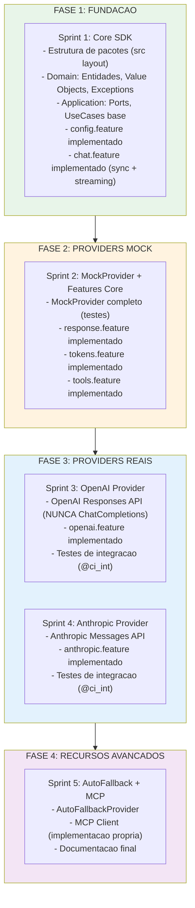
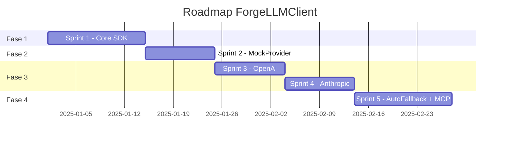
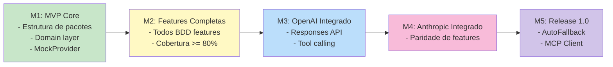
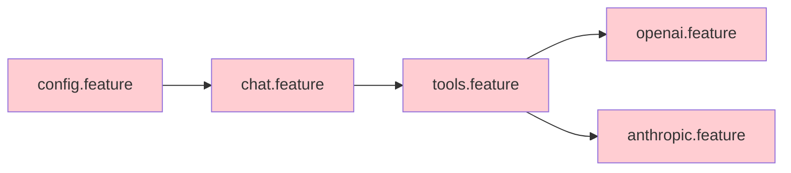
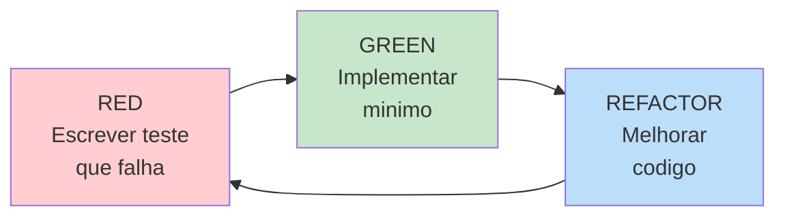

# Roadmap — ForgeLLMClient

> **Versao:** 1.0
> **Data:** 2025-12-03
> **Status:** Em Planejamento

---

## Visao Geral

O ForgeLLMClient e um SDK Python que fornece interface unificada para multiplos provedores de LLM (OpenAI, Anthropic, etc.) seguindo Clean Architecture e padroes ForgeBase.

---

## Fases do Projeto

---

## Timeline Visual

---

## Marcos (Milestones)

### M1: MVP Core
- Estrutura de pacotes criada
- Domain layer completo
- Application layer com ports definidos
- MockProvider funcional
- Testes BDD passando (config, chat)

### M2: Features Completas
- Todos os features BDD implementados
- MockProvider com cobertura total
- response, tokens, tools funcionais
- Cobertura >= 80%

### M3: OpenAI Integrado
- OpenAI Provider usando Responses API
- Testes de integracao passando
- Chat sync e streaming funcionais
- Tool calling funcional

### M4: Anthropic Integrado
- Anthropic Provider funcional
- Testes de integracao passando
- Paridade de features com OpenAI

### M5: Release 1.0
- AutoFallbackProvider
- MCP Client
- Documentacao completa
- Package publicavel

---

## Caminho Critico

Todas as features no caminho critico devem ser implementadas sequencialmente.

---

## Prioridades

| Prioridade | Descricao | Features |
|------------|-----------|----------|
| **P0** (Critico) | Essencial para MVP | config, chat, tools |
| **P1** (Alto) | Necessario para uso real | openai, anthropic, response, tokens |
| **P2** (Medio) | Recursos avancados | autofallback, mcp |
| **P3** (Baixo) | Nice-to-have | metricas, observabilidade |

---

## Metodologia

### TDD Mandatorio

1. **Testes SEMPRE escritos antes do codigo**
2. Cenarios BDD guiam os testes
3. Cobertura minima: 80%
4. CI falha se cobertura cair

### BDD como Especificacao

- Features em `specs/bdd/*.feature`
- Steps em `tests/bdd/`
- Cenarios com `@skip` removidos conforme implementacao

---

## Estrutura de Entregas

### Por Sprint

1. Codigo fonte implementado
2. Testes passando (unit + BDD)
3. Documentacao atualizada
4. Cobertura mantida

### Por Milestone

1. Release notes
2. Changelog
3. Documentacao de API
4. Exemplos de uso

---

## Riscos e Mitigacoes

| Risco | Impacto | Mitigacao |
|-------|---------|-----------|
| OpenAI muda Responses API | Alto | Abstrair em adapter, testes de integracao |
| ForgeBase incompativel | Medio | Versao fixa, testes de regressao |
| Performance streaming | Medio | Benchmarks, async otimizado |

---

## Proximos Passos

1. [ ] Stakeholder aprova roadmap
2. [ ] Iniciar Sprint 1 (Fundacao)
3. [ ] Criar estrutura de pacotes
4. [ ] Implementar primeiro teste BDD

---

## Referencias

- `specs/roadmap/BACKLOG.md` - Backlog detalhado
- `specs/roadmap/dependency_graph.md` - Grafo de dependencias
- `specs/roadmap/TECH_STACK.md` - Stack tecnologico
- `specs/roadmap/HLD.md` - Design de alto nivel
- `specs/roadmap/LLD.md` - Design de baixo nivel

---

*Documento gerado pelo Roadmap Planning Process*
