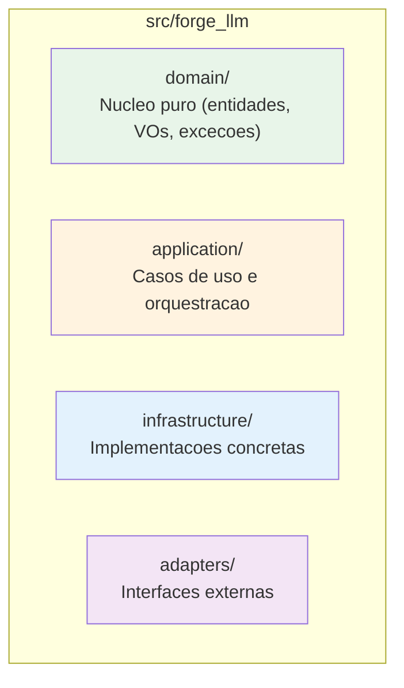
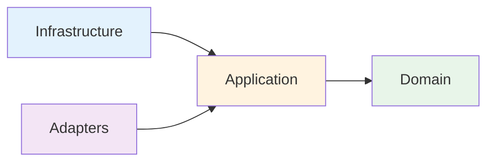

# ADR-001: Arquitetura Clean + Hexagonal (ForgeBase)

**Status**: Aceito
**Data**: 2025-12-03
**Decisores**: Stakeholder

## Contexto

O ForgeLLMClient precisa de uma arquitetura que permita:
- Testabilidade isolada de componentes
- Troca de provedores LLM sem afetar logica de negocio
- Extensibilidade para novos provedores e funcionalidades
- Alinhamento com o ecossistema Forge (ForgeBase, ForgeProcess)

## Decisao

Adotar **Clean Architecture + Hexagonal Architecture** conforme implementado pelo ForgeBase.

### Estrutura de Camadas

### Regras de Dependencia

### Classes Base

| Componente | Base Class ForgeBase |
|------------|---------------------|
| Entidade | `EntityBase` |
| Value Object | `ValueObjectBase` |
| UseCase | `UseCaseBase` |
| Port | ABC / `PortBase` |
| Adapter | `AdapterBase` |

## Alternativas Consideradas

### 1. Arquitetura em Camadas Simples
- **Pros**: Mais simples inicialmente
- **Contras**: Acoplamento entre camadas, dificil testar

### 2. Arquitetura Modular sem ForgeBase
- **Pros**: Menos dependencias
- **Contras**: Reinventar a roda, perder observabilidade nativa

### 3. Clean + Hexagonal com ForgeBase (ESCOLHIDA)
- **Pros**: Testabilidade, extensibilidade, observabilidade nativa, alinhamento com ecossistema
- **Contras**: Curva de aprendizado inicial

## Consequencias

### Positivas
- Codigo testavel e isolado
- Facil trocar implementacoes (provedores, persistencia)
- Observabilidade nativa via ForgeBase
- Padronizacao com outros projetos Forge

### Negativas
- Mais boilerplate inicial
- Curva de aprendizado para novos desenvolvedores

## Validacao

- [ ] Testes unitarios passam em todas as camadas isoladamente
- [ ] import-linter valida boundaries entre camadas
- [ ] Novos provedores podem ser adicionados sem modificar core

## Referencias

- `docs/guides/forgebase_guides/referencia/arquitetura.md`
- `docs/guides/forgebase_guides/usuarios/forgebase-rules.md`
