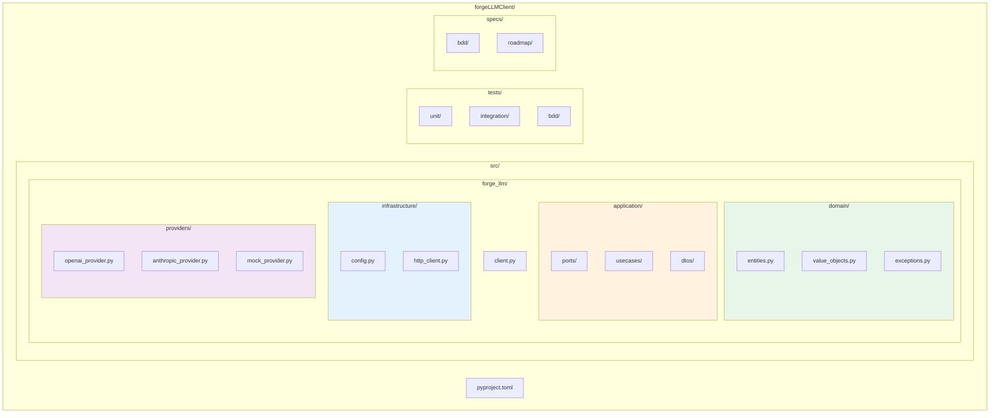
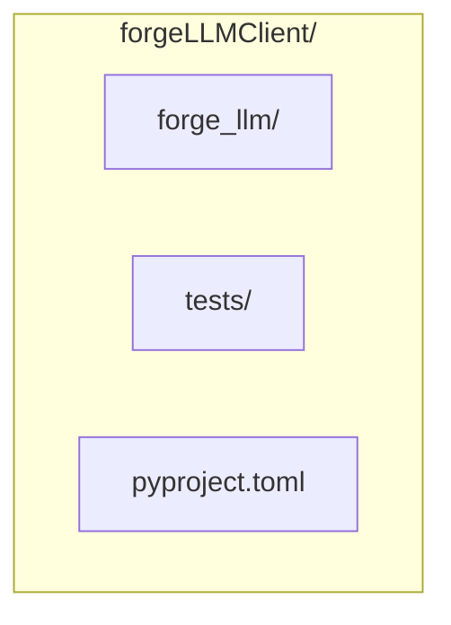

# ADR-005: Monorepo com src layout

**Status**: Aceito
**Data**: 2025-12-03
**Decisores**: Stakeholder

## Contexto

Precisamos definir a estrutura de diretorios do projeto ForgeLLMClient.
Opcoes principais:
- Flat layout (pacote na raiz)
- src layout (pacote dentro de src/)
- Multi-repo (repositorios separados)

## Decisao

Usar **Monorepo com src layout**.

### Estrutura



### Nome do Pacote

- **Diretorio**: `forge_llm` (underscore)
- **PyPI**: `forge-llm` (hifen)

## Alternativas Consideradas

### 1. Flat layout



- **Pros**: Mais simples
- **Contras**: Pode causar conflitos de import durante desenvolvimento

### 2. Multi-repo
- **Pros**: Versionamento independente
- **Contras**: Overhead de manutencao, sincronizacao complexa

### 3. src layout (ESCOLHIDA)
- **Pros**: Padrao moderno, evita conflitos, facil publicar
- **Contras**: Ligeiramente mais verboso

## Consequencias

### Positivas
- Imports sempre funcionam corretamente
- Facil publicar no PyPI
- Testes rodam contra pacote instalado, nao fonte
- Alinhado com recomendacoes modernas Python

### Negativas
- Um nivel extra de diretorio
- Precisa instalar pacote para rodar (`pip install -e .`)

## Configuracao pyproject.toml

```toml
[project]
name = "forge-llm"
version = "0.1.0"

[tool.setuptools.packages.find]
where = ["src"]
```

## Validacao

- [ ] `pip install -e .` funciona
- [ ] Imports funcionam: `from forge_llm import Client`
- [ ] Testes rodam corretamente
- [ ] Build gera pacote correto

## Referencias

- https://packaging.python.org/en/latest/discussions/src-layout-vs-flat-layout/
- PEP 621
