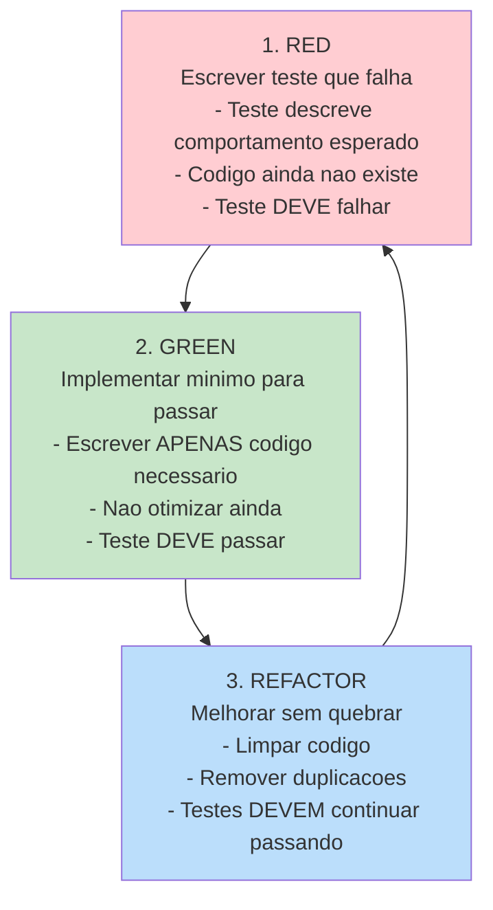
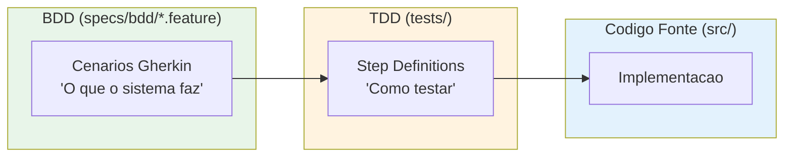
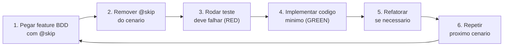
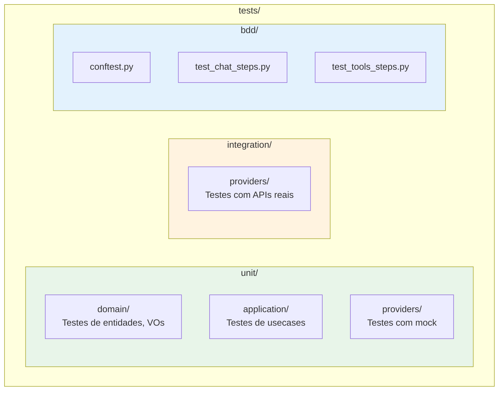

# ADR-006: TDD como Metodologia de Desenvolvimento

**Status**: Aceito
**Data**: 2025-12-03
**Decisores**: Stakeholder

## Contexto

O ForgeLLMClient sera desenvolvido seguindo o ForgeProcess, que define BDD para especificacao e TDD para implementacao.

O stakeholder definiu como **MANDATORIO** que testes sejam escritos ANTES do codigo fonte.

## Decisao

Adotar **TDD (Test-Driven Development)** como metodologia de desenvolvimento.

### Regra Fundamental

**TESTES SEMPRE ESCRITOS ANTES DO CODIGO FONTE**

### Ciclo TDD



### Integracao com BDD



### Fluxo de Trabalho



### Estrutura de Testes



### Markers pytest

```python
# pytest.ini ja configurado com:
# @ci_fast - Testes rapidos (mocks)
# @ci_int  - Testes de integracao (APIs reais)

# Rodar apenas testes rapidos
pytest -m "ci_fast"

# Rodar testes de integracao
pytest -m "ci_int"
```

## Alternativas Consideradas

### 1. Desenvolvimento tradicional (codigo primeiro)
- **Pros**: Mais rapido inicialmente
- **Contras**: Menos cobertura, mais bugs, dificil refatorar

### 2. Testes depois do codigo
- **Pros**: Ver codigo funcionando antes
- **Contras**: Testes tendem a ser esquecidos, vieses de confirmacao

### 3. TDD (ESCOLHIDA - MANDATORIO)
- **Pros**: Codigo testavel por design, documentacao viva, refatoracao segura
- **Contras**: Curva de aprendizado, pode parecer mais lento inicialmente

## Consequencias

### Positivas
- Codigo testavel desde o inicio
- Documentacao viva via testes
- Refatoracao segura (testes como rede de seguranca)
- Bugs detectados cedo
- Design emergente e limpo

### Negativas
- Requer disciplina
- Pode parecer mais lento inicialmente
- Precisa saber escrever bons testes

## Metas de Cobertura

| Camada | Meta |
|--------|------|
| Domain | >= 95% |
| Application | >= 90% |
| Infrastructure | >= 80% |
| Adapters | >= 70% |
| **Total** | **>= 80%** |

## Validacao

- [ ] Nenhum codigo fonte sem teste correspondente
- [ ] Cobertura >= 80%
- [ ] CI falha se cobertura cair
- [ ] Todos os cenarios BDD tem step definitions

## Referencias

- `docs/guides/forgebase_guides/usuarios/guia-de-testes.md`
- `process/execution/tdd/TDD_PROCESS.md`
- Kent Beck - Test-Driven Development by Example
