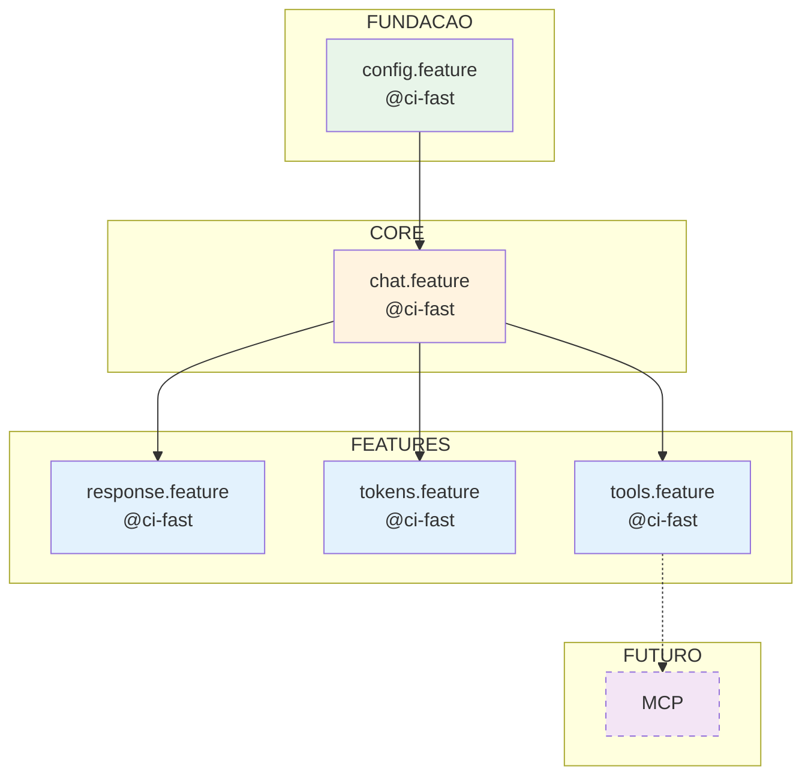
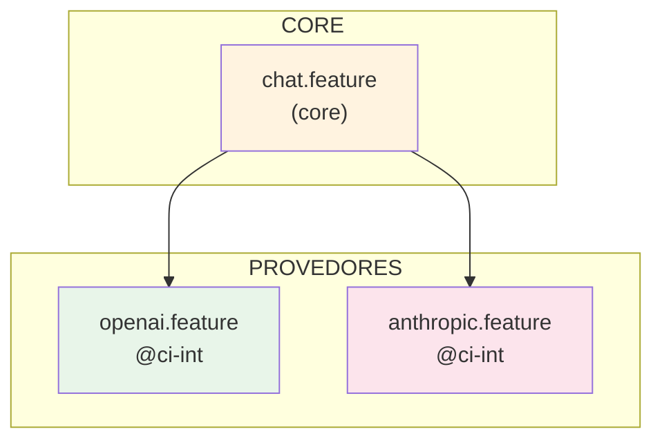
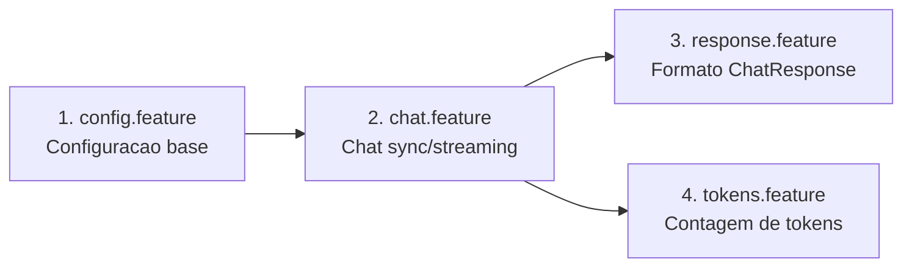
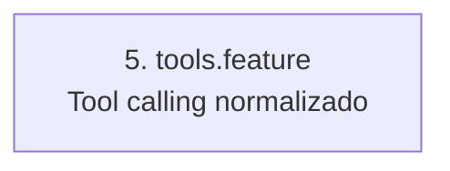
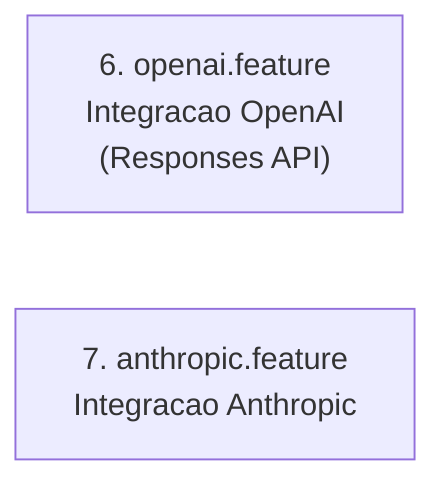
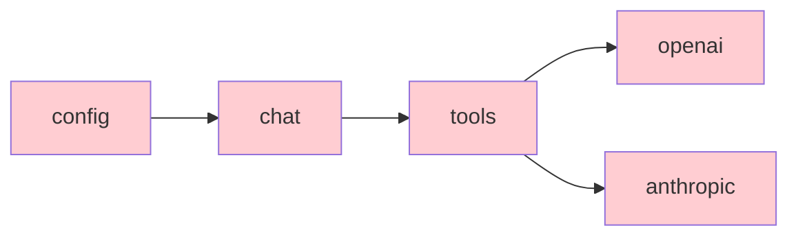

# Grafo de Dependencias — ForgeLLMClient

> Mapeamento de dependencias entre features BDD

---

## Grafo de Features

---

## Grafo de Provedores

---

## Ordem de Implementacao

### Sprint 1: Fundacao (P0 - CRITICO)

### Sprint 2: Tool Calling (P0 - CRITICO)

### Sprint 3: Provedores Reais (P1 - ALTO)

---

## Matriz de Dependencias

| Feature | Depende de | Bloqueia |
|---------|------------|----------|
| config.feature | - | chat, response, tokens, tools |
| chat.feature | config | response, tokens, tools, openai, anthropic |
| response.feature | chat | - |
| tokens.feature | chat | - |
| tools.feature | chat | openai, anthropic |
| openai.feature | chat, tools | - |
| anthropic.feature | chat, tools | - |

---

## Caminho Critico

Todas as features neste caminho devem ser implementadas sequencialmente.

---

## Legenda

| Simbolo | Significado |
|---------|-------------|
| `@ci-fast` | Testes rapidos com mocks |
| `@ci-int` | Testes de integracao (API real) |
| `P0` | Prioridade critica |
| `P1` | Prioridade alta |

---

*Documento gerado pelo Roadmap Planning Process*
